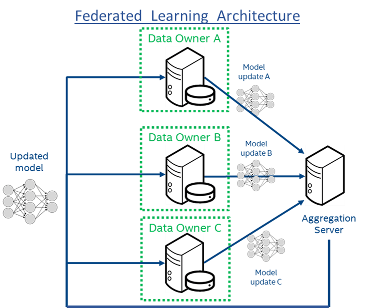

# Federated Learning framework to preserve privacy

## Abstract
This machine learning system can diagnose 2 acute inflammations of bladder. The medical dataset contains features and diagnoses of 2 diseases of the urinary system: **Inflammation of urinary bladder** and **nephritis of renal pelvis origin**. This medical dataset truly needs privacy! Because we cannot divulge the sexually-transmitted diseases of patients. So, what we learned about PySyft and OpenMined is applied in this project. Federated learning will protect the privacy of datasets in each hospital and at the same time, a more robust machine learning model will benefit all hospitals. Why? Because the machine learning model generated in this project is 100% accurate; whereas human doctors can commit mistakes when diagnosing these 2 diseases.

## DATASET

Acute Inflammations Data Set <br>
https://archive.ics.uci.edu/ml/datasets/Acute+Inflammations

## Software Requirements

Please make sure that the following software is installed before running this machine learning system:
- Python 3.7.3 (imports: urllib.request, numpy, matplotlib.pyplot)
- PyTorch 1.1.0 (imports: torch, torch.autograd, torch.nn, torch.nn.functional, torch.optim)
- PySyft (imports: syft)

## Instructions

Download all the files and run the Jupyter notebook "Bladder Dataset.ipynb", which contains both explanations and source code. Here are some Unix commands to run the Jupyter notebook "Bladder Dataset.ipynb": 

```
# spaic is a conda environment with Python, PyTorch, and PySyft already installed.
source activate spaic 
jupyter notebook Bladder\ Dataset.ipynb
```

Alternatively, you can also click on the Jupyter notebook <a href='Bladder Dataset.ipynb'>Bladder Dataset.ipynb</a> directly, which is an easier method.

## Relevance & Potential 

Machine learning projects are great to improve our world, to solve problems, and to take informed decisions. This project could help doctors to diagnose diseases of the urinary tract correctly. And then doctors could take the appropriate actions to cure such diseases. In fact, this machine learning system is 100% accurate; whereas human doctors can commit mistakes when diagnosing these 2 diseases. However, forgotten aspects of machine learning are security and privacy. This machine learning is not only very useful and accurate; but it also protects the privacy of datasets in each hospital by using federated learning. Moreover, some patients could be ashamed of their urinary diseases and can consult the diagnosis of this machine learning system before visiting a human doctor.

This machine learning system also has a lot of potential for the future. The code of this ML system is an useful pattern that can be copied and extrapolated to more complex kinds of diagnoses for other diseases. For example, we can change the logistic regression algorithm for a convolutional neural network capable of dealing with datasets of medical images. And the logic to protect the privacy of datasets in each hospital will be the same.

## Federate Learning with a Trusted Aggregator

In this demo, there are 4 hospitals. (The dataset will be split in 4, randomly.) There could be more hospitals. The 4 hospitals cannot share the cases of their patients because they are competitors and it is necessary to protect the privacy of patients. Hence, the ML model will be learned in a federated way. 

How? Federated learning is iterated 1000 times. At each iteration, a copy of the shared model is sent to all the 4 hospitals. Each hospital trains its own local model with its own local dataset, in 5 local iterations. Each local model improves a little bit in its own direction. Then we compute the local losses and local accuracies to keep track of them and to make graphs of them. We send the local models to the trusted aggregator that will average all the model updates. This averaged model is the shared model that is sent to all the 4 hospitals at the begining of each iteration.

In this way, only the ML model will be shared. Whereas the local cases of each hospital will be kept private and they will be used to train model updates in a local way. Federated learning will protect the privacy of datasets in each hospital and at the same time, we will generate a more robust machine learning model, which will benefit all hospitals. This shared ML model preserves the privacy of individual patients and at the same time, reveals important statistics of stereotypical cases.

<p align="center">
 <br>
 Federated Learning - Image taken from <a href="https://www.intel.ai/federated-learning-for-medical-imaging/">https://www.intel.ai/federated-learning-for-medical-imaging/</a>
</p>
